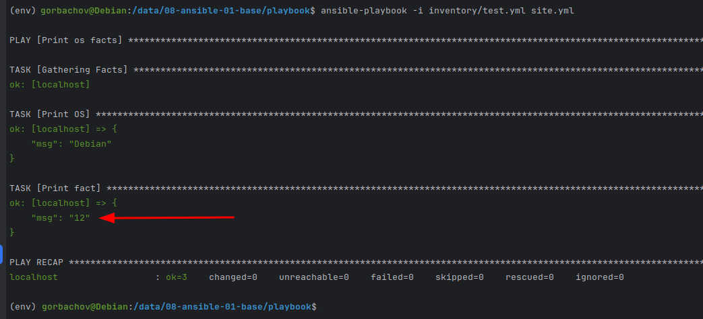

# Домашнее задание к занятию 1 «Введение в Ansible» - `Горбачев Олег`

## Основная часть

1. Попробуйте запустить playbook на окружении из `test.yml`, зафиксируйте значение, которое имеет факт `some_fact` для указанного хоста при выполнении playbook.
2. Найдите файл с переменными (group_vars), в котором задаётся найденное в первом пункте значение, и поменяйте его на `all default fact`.
3. Воспользуйтесь подготовленным (используется `docker`) или создайте собственное окружение для проведения дальнейших испытаний.
4. Проведите запуск playbook на окружении из `prod.yml`. Зафиксируйте полученные значения `some_fact` для каждого из `managed host`.
5. Добавьте факты в `group_vars` каждой из групп хостов так, чтобы для `some_fact` получились значения: для `deb` — `deb default fact`, для `el` — `el default fact`.
6.  Повторите запуск playbook на окружении `prod.yml`. Убедитесь, что выдаются корректные значения для всех хостов.
7. При помощи `ansible-vault` зашифруйте факты в `group_vars/deb` и `group_vars/el` с паролем `netology`.
8. Запустите playbook на окружении `prod.yml`. При запуске `ansible` должен запросить у вас пароль. Убедитесь в работоспособности.
9. Посмотрите при помощи `ansible-doc` список плагинов для подключения. Выберите подходящий для работы на `control node`.
10. В `prod.yml` добавьте новую группу хостов с именем  `local`, в ней разместите localhost с необходимым типом подключения.
11. Запустите playbook на окружении `prod.yml`. При запуске `ansible` должен запросить у вас пароль. Убедитесь, что факты `some_fact` для каждого из хостов определены из верных `group_vars`.
12. Заполните `README.md` ответами на вопросы. Сделайте `git push` в ветку `master`. В ответе отправьте ссылку на ваш открытый репозиторий с изменённым `playbook` и заполненным `README.md`.

## Решение основной части

1. Запускаю playbook, вижу что значение, которое находится в `some_fact` - 12:

2. Меняю найденное значение на `all default fact`.

3. Буду использовать готовое `docker` окружение.

4. Запускаю playbook на окружении из prod. Получаю следующие значения `some_fact`:

5. Меняю факты в `group_vars`, до `deb default fact` и `el default fact`.

6. Повторяю запуск окружения `prod.yml`. Получаю следующие значения `some_fact`:

7. При помощи `ansible-vault` шифрую факты в `group_vars/deb` и `group_vars/el` с паролем `netology`:

Зашифрованные файлы получаются такого вида:

8. Запускаю playbook на окружении `prod.yml`. При запуске `ansible` запрашивает пароль:

Playbook выполнился.

9. При помощи `ansible-doc` смотрю список плагинов для подключения. Подходящий для работы на `control node`:

10. В `prod.yml` добавил новую группу хостов с именем  `local`, в ней разместил localhost с необходимым типом подключения:

11. Запустил playbook на окружении `prod.yml`. При запуске `ansible` запросил пароль. Факты `some_fact` для каждого из хостов получились следующими:

12. Заполнил README.md, запушил в свой репозиторий. [Ссылка](https://github.com/DemoniumBlack/fedorchukds-devops-33-16/tree/main/SRC/playbook) на playbook.

